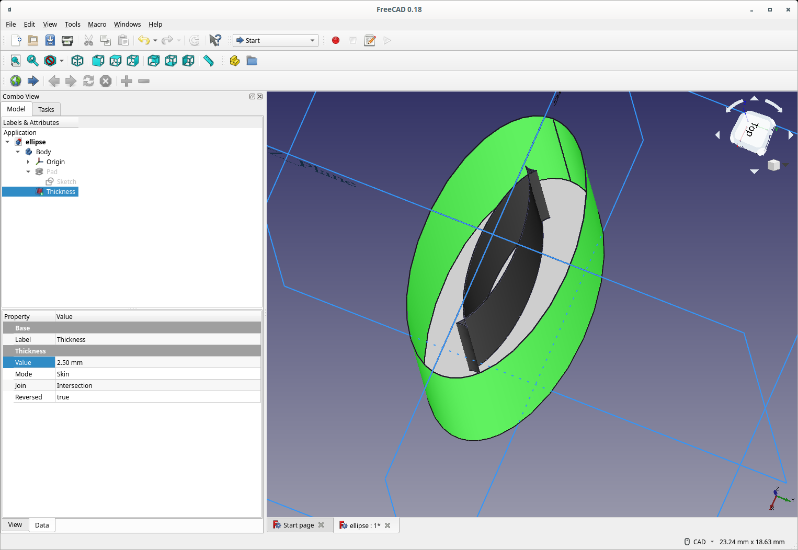

# Explore ellipse in FreeCAD

This is the "same" as ellipses in CadQuery. If the thickness
is greater than a certian value the inner ellipse becomes
pointy and inverts as you continue to increase and the
shell becomes "weird".

For example thickness=2.5mm:

